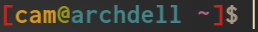
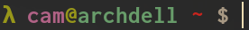

Your terminal can be customized in several different ways including how your prompt appears. You can color code shell variables such as your username and directory do display useful information in the current directory.

Bash prints a global variable `PS1` whenever you open up a terminal and type commands. If you need to type additional commands, the variable `PS2` is printed. You can see this if you ever forget to close a quote or type `\` to continue the line at the end of a command:

```sh
 $ echo "Hello world!
 >
```

- `$` first bash prompt (`$PS1`)
- `>`  second bash prompt (`$PS2`)

Of course, you can see what these variables are by echoing `$PS1` in the shell. To change the prompt, you'll re-export `$PS1` in either your `~/.bash_profile` or `~/.bashrc` file.

We will can following special characters in the prompts.

`character`|description
:----:|:-----
`\h`|the hostname (up to first `.`)
`\H`|the hostname (fully complete)
`\t`|24-hr time in HH:MM:SS format
`\T`|12-hr time in HH:MM:SS format
`\u`|the current username
`\W`|the current working directory (i.e. `Downloads`)
`\w`|the complete path from `~` of current working directory (i.e. `~/Downloads/AustinsEmacsBookCollection/`)
`\$`|displays `#` if root user, `$` if non-root user

Let's say you want to add your username and current directory to the bash prompt.

In your `.bashrc`, you'd add or replace the line exporting `$PS1` with:

```sh
export PS1="[\u \W] "
```

Note that the extra space is needed to separate where your cursor starts.

Let's say you instead wanted something like `<time> [ <username>@<hostname> ] <full-path>`

```sh
export PS1="\T [\u@\H] \w "
```

To add color, you can use any of the following commands to spice up your terminal prompt. For enhancing visuals, we'll use `tput`, an `ncurses` utility to initialize a terminal.

The general format to set output format will be `\[$(tput <command>)\]` or `\[$(tput <option> <CODE>)\]`.

`tput` can be used with the following options

**Options**

`option`|description
:---:|:----
`bold`|make text bold
`rev`|reverse foreground/background
`sgr0`|reset output format
`setaf`|set output color

**Colors**

code|color
:------:|:------
0|black
1|red
2|green
3|yellow
4|blue
5|magenta
6|cyan
7|white

A couple of recommendations:
- after setting prompt colors, reset your output format using `\[$(tput sgr0)\] `
- add an extra space at the end of the prompt

Here are a few examples:

----

```sh
export PS1="\[$(tput bold)\]\[$(tput setaf 1)\][\[$(tput setaf 3)\]\u\[$(tput setaf 2)\]@\[$(tput setaf 4)\]\h \[$(tput setaf 5)\]\W\[$(tput setaf 1)\]]\[$(tput setaf 7)\]\\$ \[$(tput sgr0)\]"
```


----


```sh
export PS1="\[$(tput bold)\]\[$(tput setaf 2)\]λ \[$(tput setaf 5)\]\u\[$(tput setaf 2)\]@\[$(tput setaf 6)\]\H \[$(tput setaf 1)\]\W\[$(tput setaf 4)\] \[$(tput setaf 7)\]\\$ \[$(tput sgr0)\]"
```

--------

```sh
export PS1="\[$(tput bold)\]\[$(tput setaf 2)\]λ \[$(tput setaf 4)\]\u \[$(tput setaf 5)\]\W \[$(tput sgr0)\]"
```

----
