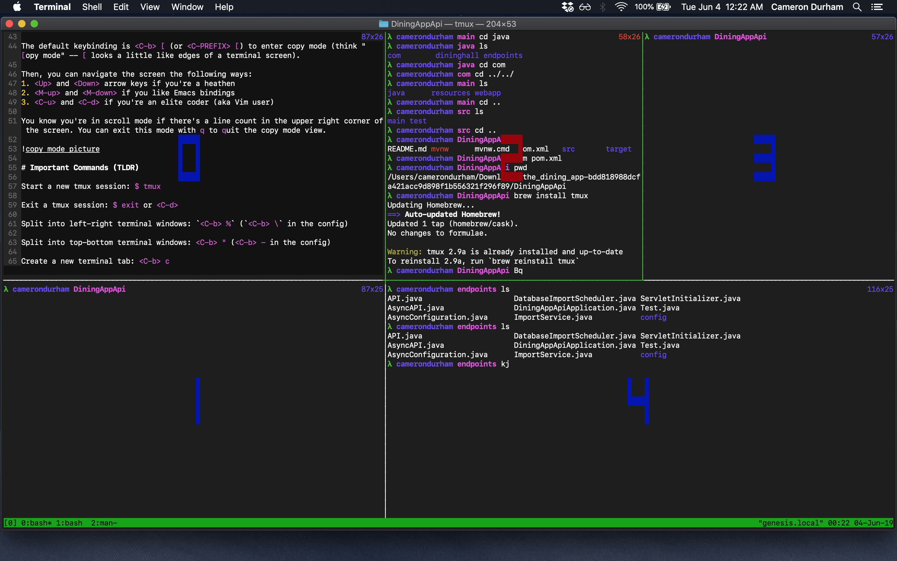
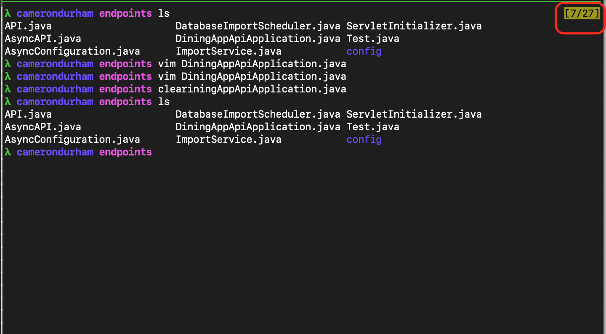

# Why `tmux`?

`tmux` is a Terminal Multi PleXer. It is a super powerful tool used to run and organize multiple shell sessions in one screen. This is especially useful if you want to `ssh` into another computer while still working on your local machine. While I'm not going to get to its advanced use in this post, it's especially handy to evaluate blocks of code or to allow editing and code execution in one window. This way, you can setup `tmux` panes so you're editing in Vim in one while watching your compilation errors accumulate in the other. :grin: You can get the functionality of an IDE but with the ~~cool-factor~~ efficiency of the terminal!

# Getting Started

You're going to need to install `tmux`. It's typically installed already on a Mac but not on Linux machines.

```sh
# Mac OS
$ brew install tmux

# Debian Based (like Ubuntu)
$ sudo apt install tmux

# Arch
$ sudo pacman -S tmux

# Start a new tmux session
$ tmux
```
# Windows and Tabs

## Windows

You came here to learn how to use tabs and windows, so here's what you need to know:
1. split screen into left-right terminal screens: `<C-b> %`
2. split screen into top-bottom terminal screens: `<C-b> "`

You'll notice that if you execute these in order, your split occurs in whichever screen has __focus__. To change which screen you type in, just change to the **o**ther screen with `<C-b> o`. Your cursor will jump from screen to screen in order of when they were created. This involves too many keystrokes usually, so it's faster to get a quick heads up of the window numbering with `<C-b> q`, then select which window to jump into. Here's what that heads up looks like:


## Tabs

Let's say you want to separate some code and a terminal prompt from a man page you're reading...

To get completely new screen to arrange, you can `c`reate a new terminal window (similar to a tab in your usual terminal application) with `<C-b> c`. Now you can create a new configuration how you see fit. You'll notice at the bottom of your `tmux` screen, there's an indexed list of all your current "tabs". You can have at most 10 tabs (indexed `0-9` of course).

To jump to tab index `0-9`, the keybinding is: `<C-b> N` (where `N` ∈ [0,9])

To close any one of your windows or tabs, simply exit the terminal as you usually would by typing `exit` in the shell, or using the keybinding `<C-d>`. Once all terminal tabs/windows are closed, your `tmux` session ends.

Oh, a cool little thing you can do is check the time with `<C-b> t`.

# Configuration

You'll notice that to create new windows, it might be a little hard to make sense of the keybindings for vertical and horizontal splitting. We can adjust such things inside a `tmux` configuration file: `$HOME/.tmux.conf`.

These next lines unbind the current use of `<C-b> \` and `<C-b> -` so you can use them for vertical and horizontal splits (respectively). A handy command to check `tmux` keybindings in your current sesion is: `<C-b>?` or  `<C-b>:list-keys`

```sh
# use | and - to split windows
bind-key \ split-window -h -c '#{pane_current_path}'
bind-key - split-window -v -c '#{pane_current_path}'
unbind '"'
unbind %
```

To preserve any terminal or editor color schemes, you'll also want to adjust the colors of your `tmux` sessions to match your terminal colors.

```sh
set-option -g default-terminal "screen-256color"
```

If you want to use Vim keybindings to move through your tabs with `<C-h>` and `<C-l>`, you can add these lines:

```sh
# moving between tabs with vim movement keys
bind -r C-h select-window -t :-
bind -r C-l select-window -t :+
```

This entire file is right here: [tmux conf](../assets/.tmux.conf)

# Scrolling

Scrolling through a window can be difficult if you've just produced several screens worth of error and debug messages. To scroll up a `tmux` window, you can enter **copy mode** and use vim or emacs keybindings to navigate the focused terminal window.

Thank to [this SO post](https://superuser.com/questions/209437/how-do-i-scroll-in-tmux) for the man pages hint.

The default keybinding is `<C-b> [` (or `<C-PREFIX> [`) to enter copy mode. You can think **[** opy mode -- `[` looks a little like edges of a terminal screen.

Then, you can navigate the screen the following ways:
1. `<Up>` and `<Down>` arrow keys if you're a heathen
2. `<M-up>` and `<M-down>` if you like Emacs bindings
3. `<C-u>` and `<C-d>` if you're an elite coder (aka Vim user)

You know you're in scroll mode if there's a line count in the upper right corner of the screen. You can exit this mode with `q` to `q`uit the copy mode view.



# Important Commands (TLDR)


`shell command`|description
:----:|:-----
`$ tmux`| Start a new `tmux` session
`$ exit` or `<C-d>` | Exit a `tmux` session


`keybinding`|description
:-----:|:----
 `<C-b> \` (**default**: `<C-b> %`)| Split into left-right terminal windows
 `<C-b> -`  (**default**: `<C-b> "`)| Split into top-bottom terminal windows
`<C-b> c` | Create a new terminal tab
`<C-b> N` | Go to terminal tab number `N`
`<C-b> o` | Jump to the **o**ther terminal window in current screen

